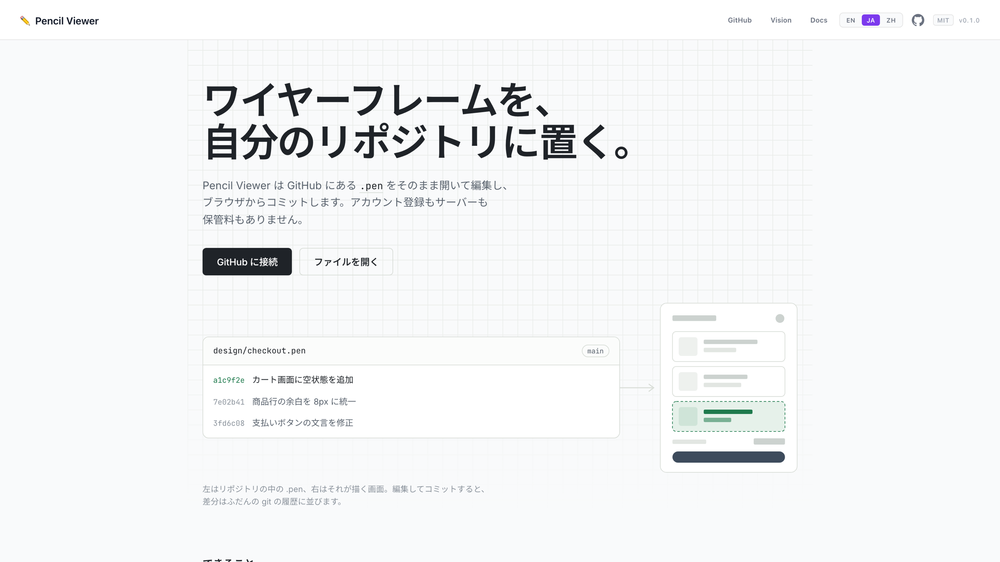
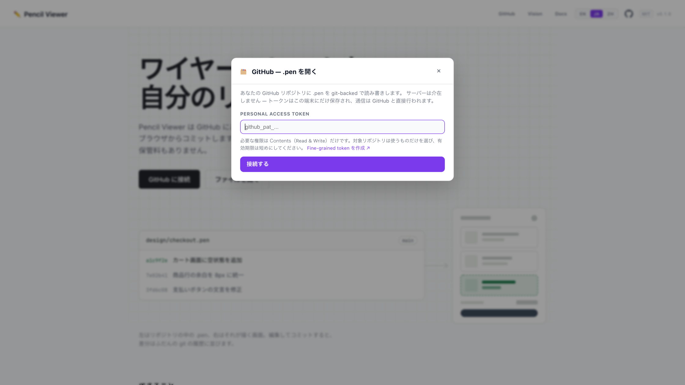
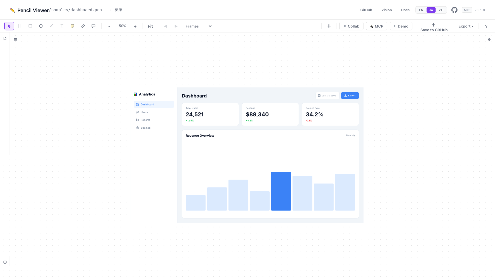
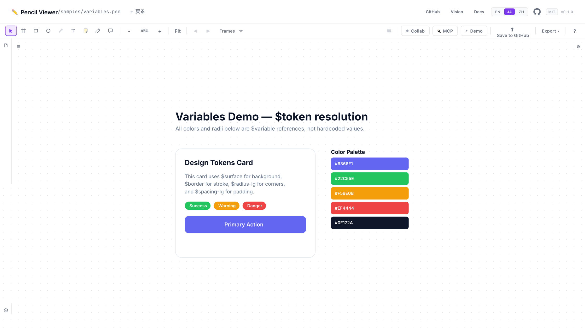
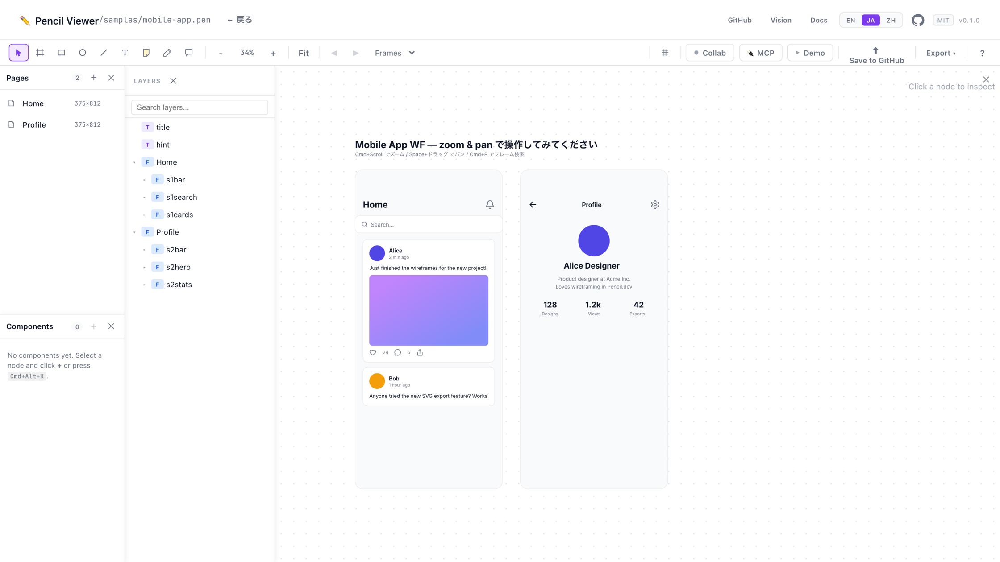

# ワイヤーフレームを自分の Git リポジトリに置く「Pencil Viewer」を作った

デザインの履歴だけ、いつも別の場所にありませんか。

コードは自分のリポジトリにあって、`git log` を追えば「いつ・誰が・なぜ」が全部わかる。
なのに画面のワイヤーフレームだけは外部サービスのクラウドの中にあって、
レビューのたびに URL を貼り直し、「最新はどれ？」を毎回確認している。

**Pencil Viewer** は、その置き場所をずらすだけのツールです。
[Pencil.dev](https://www.pencil.dev/) の `.pen` ファイルを**あなたの GitHub リポジトリ**に置いて、
ブラウザから開いて、編集して、コミットする。それだけです。

- デモ: <https://pregum.github.io/pencil_viewer/>
- リポジトリ: <https://github.com/Pregum/pencil_viewer>（MIT）

[:contents]

---

## 紹介動画（約 50 秒）

<!-- TODO: YouTube に上げてから、動画 URL をこの行に貼る（はてなは URL 単体行で自動埋め込み） -->
<!-- はてなフォトライフは mp4 を置けないため、GIF を貼る場合は promo/out/pencil-viewer-intro.gif をアップロードして下の行を使う -->
<!-- [f:id:YOUR_HATENA_ID:20260915000000g:plain] -->

---

## 何が違うのか

デザインツールそのものを作り直したいわけではありません。
やりたかったのは「デザインの置き場所を、コードと同じにする」ことだけです。

|                    | よくある構成                 | Pencil Viewer                           |
| ------------------ | ---------------------------- | --------------------------------------- |
| ファイルの置き場所 | サービス側のクラウド         | **あなたの GitHub リポジトリ**          |
| 履歴               | サービス独自のバージョン履歴 | **ふだんの git のコミット**             |
| バックエンド       | あり                         | **なし**（GitHub Pages の静的ファイル） |
| サービスへの登録   | 必要                         | 不要（GitHub の PAT を貼るだけ）        |
| ランニングコスト   | 人数・容量で増える           | **$0**                                  |

保管しているものが無いので、増える請求もありません。
アプリは GitHub Pages に置かれた静的ファイルで、デザインの実体はあなたのリポジトリにあります。



---

## 使いはじめ方

### 1. トークンを作る

GitHub の **fine-grained personal access token** を作ります。
必要な権限は **Contents: Read and write** だけ。対象リポジトリも、使うものだけ選べば十分です。
有効期限は短めにしておくのがおすすめです。

### 2. 「GitHub に接続」でトークンを貼る



トークンは**この端末の `localStorage` にだけ**保存されます。
通信はブラウザから `api.github.com` へ CORS で直接行われ、途中にサーバーは入りません。
（このプロジェクトはトークンもファイルも一切受け取りません）

### 3. リポジトリとブランチを選んで `.pen` を開く

そのブランチにある `.pen` が一覧に出ます。開いて編集したら、ツールバーのボタンは **Commit** に変わります。
押してメッセージを書けば、それがそのままコミットになります。

GitHub 由来でないドキュメント（ドラッグ&ドロップで開いたものなど）の場合はボタンが **Save to GitHub** になり、
保存先のリポジトリ・ブランチ・パスを選んで新規コミットを作れます。

ヘッダーのファイルパスをクリックすると、そのファイルのコミットログが出ます。
過去の版を開いて中身を見て、そのまま復元できます。
**保存はコミット。差分はふだんの git の履歴に並びます。**

> ブランチが動いていて衝突したときは、force push するか最新を取り直すかを選べます。

---

## ちゃんと「読める」し「直せる」

置き場所の話だけしてきましたが、ビューア/エディタとしても実用範囲に入れてあります。

### 描画

`.pen` のフォーマットは一通りサポートしています。

- rectangle / ellipse / line / polygon / path / text / frame / group / icon_font（Material Symbols + Lucide）
- flex レイアウト（horizontal / vertical / justify / align / gap / padding / `fill_container` / `fit_content`）
- 塗りと効果（単色・linear/radial グラデーション・画像塗り・blur・drop shadow）
- ドキュメント内の `$token` 変数参照の解決
- `ref`（コンポーネントインスタンス）の解決



色も角丸も余白もハードコードではなく `$token` のまま描画されるので、
「デザイントークンを変えたら全部変わる」がそのまま確認できます。



未知のノード型は破線のプレースホルダとして描かれます。
1 つ壊れていても全体が真っ白になることはありません。

### 編集



- クリックで選択、右側のプロパティパネルで編集、ドラッグで移動、ハンドルでリサイズ
- Undo / Redo（`Cmd+Z` / `Cmd+Shift+Z`。ドラッグ 1 回は 1 undo にまとまります）
- レイヤーパネル、コマンドパレット（`Cmd+Shift+P`）、整列・分配
- フレーム検索（`Cmd+P`、ミニマップ付き）
- Figma 風のキャンバス操作（`Cmd+スクロール` でズーム、Space+ドラッグでパン）
- **vim モード** — `hjkl` 移動、EasyMotion 風のヒントラベル（`f`/`t`）、テキストオブジェクト（`vif`/`vaf`/`vir`/`vic`）、数値プレフィックス

スマホでは編集パネルを畳んでキャンバスを広げるので、移動中に確認するだけ、という使い方もできます。

---

## エンジニア向けに開いている口

ここから先は「任意で足せるもの」です。**いずれも既定では無効**で、必要なときだけ有効にします。

### MCP / REST ブリッジ（Claude Code 連携）

ローカルで collab-bridge を立てると、Claude Code や `curl` からキャンバス上のノードを読み書きできます。

```bash
cd tools/collab-bridge && npm start
```

WebRTC 経由でリアルタイムに反映され、AI が編集したノードにはスキャナ + パルスの
アニメーションが走るので「どこが変わったか」が目で追えます。

### CI で `.pen` を検証する GitHub Action

PR に含まれる `.pen` を、ビューアが使っているのと同じ zod スキーマで検証します。

```yaml
name: Design check

on:
  pull_request:
    paths: ['**/*.pen']

permissions:
  contents: read
  pull-requests: write

jobs:
  design:
    runs-on: ubuntu-latest
    steps:
      - uses: actions/checkout@v5
      - uses: Pregum/pencil_viewer/tools/pen-audit@main
```

あわせて **Five UI States**（ideal / empty / loading / error / partial）のカバレッジも
レポートします。こちらはフレーム名からのヒューリスティックなので既定では警告どまりです。

API キーも外部サービスも言語モデルも使いません。同じファイルからは必ず同じレポートが出ます。

### そのほか

- **AI デザインレビュー** — Cloudflare Workers AI（Llama 3.3 70B）。不足している UI 状態や
  アクセシビリティの問題を指摘して、足りないフレームをワンクリックで生成できます。
  `VITE_AI_REVIEW_URL` を設定したときだけパネルが出ます。
- **P2P 共同編集** — WebRTC + Yjs（CRDT）。サーバーにデータは残りません。
- **URL 共有** — Cloudflare Workers + KV（任意）。`VITE_SHARE_API_URL` 未設定なら共有ボタンごと消えます。
- **デザインドキュメント出力** — コンポーネント構成・UI 状態カバレッジ・デザイントークンを Markdown で書き出し。

---

## 技術的な中身

```
JSON (.pen file)
  → parsePenText (zod でバリデーション)      src/pen/parser.ts
  → substituteVariables ($token の解決)      src/pen/variables.ts
  → layoutDocument (flex の 2 パス)          src/pen/layout/flex.ts
  → PenViewer + renderers (SVG)              src/pen/renderer/
```

React 19 + TypeScript + Vite。描画は SVG です。

ローカルで動かす場合:

```bash
npm install
npm run dev     # http://localhost:5173
npm test        # vitest
npm run build   # dist/ に本番ビルド
```

`main` に push すると GitHub Actions が GitHub Pages にデプロイします。
自分のフォークで動かす場合は Settings → Pages → Source を **GitHub Actions** にするだけです。

---

## まだやっていないこと

- Notion API 連携（ページの直接作成・更新）— 着手中
- CI 連携の拡張（GitHub Actions でのデザインレビュー）— 着手中
- Figma インポート（Figma API → `.pen` 変換）— **やらない予定**

最後のものについて補足すると、これは Figma の置き換えを狙ったツールではありません。
「デザインの置き場所を git にする」という一点だけを解いています。

---

## さわってみてください

サインインは要りません。サンプルを開くところからどうぞ。

- **デモ**: <https://pregum.github.io/pencil_viewer/>
- **リポジトリ**: <https://github.com/Pregum/pencil_viewer>

使ってみて「ここが足りない」「ここが動かない」があれば、
[Issue](https://github.com/Pregum/pencil_viewer/issues) に書いていただけると嬉しいです。
Pull Request も歓迎です。MIT ライセンスなので、フォークして自分用に改造するのも自由です。

もし「置き場所が git である」ことに刺さるところがあれば、
GitHub で ⭐ をいただけると励みになります。
